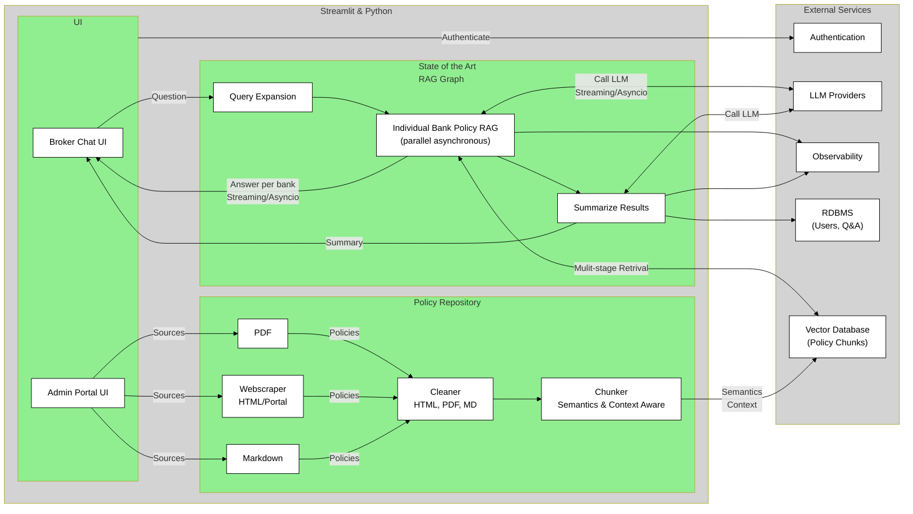
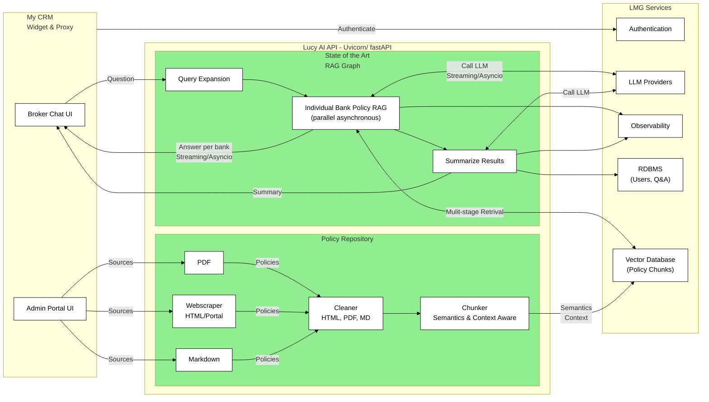

# Current State Architecture

The current state look like the diagram below. The green box are the major sub system, ie., 
- UI: The chat front end. Build in streamlit and run in streamlit.io. Uses async programming to process multiple, parallel streaming inputs. This improves the UX by lowering the latency (time to first character) 
- RAG Graph: This is a sate of the art multi-stage Graph based RAG. This also uses async programming to consume and creates multiple, parallel streaming inputs and outputs. 
- Policy Repository: A set of functons to find, strip, clean and chunk the Policy data. This is also based on streamlit.

The grey box are the commodity external (SaaS) sevices used by Policy Pal

## Future state
The LMG future state looks like the diagram below, where the green boxes are the code that can be migrated to Lucy AI. 
- RAG Graph: Would need to be decoupled via fastAPIs from the UI and connected to a myCRM / Lucy Chat UI. The external SaaS service would be replaced by LMG services. 
- Policy Repo:  The Policy Repo could be turned into a set of APIs that are called by myCRM but keeping this as a standalone streamlit ap, hosted in LMG, and connected to the LMG vector store would be a better option.

## Roadmap
A road map needs to be prepared, and could be done many ways. My recommendation would be to do this in a incremental fashion, probably
1. Rehost the UI/RAG/Repo streamlit app in an LMG managed container. 
2. Migrate the  external services one by one
3. Partition the RAG from teh UI and run in streamlit
4. Migrate to a myCRM, JS client. 